## Program/Recover Chinese Clone of the stlinkv2

* I accidentally bricked my st-link clone while trying to update the firmware

<p align="center">
  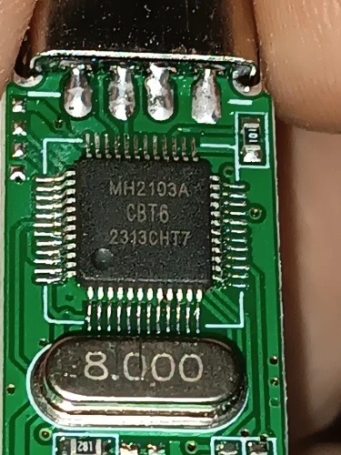
</p>

* I found it was powered by a chinese STM32 Clone called MH2103A-CBT6
    * It is supposed to be a pin to pin clone of the STM32F103
<p align="center">
  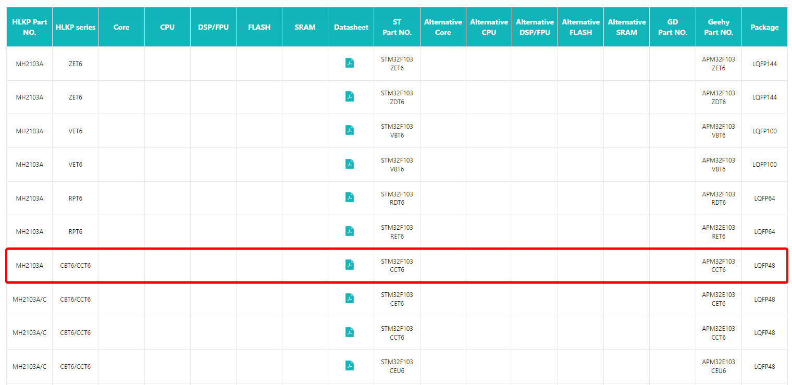
</p>

<p align="center">
  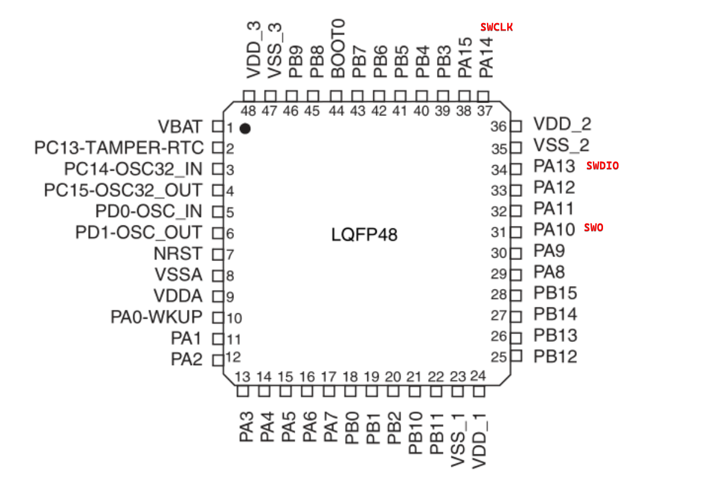
</p>

* You need another st-link to flash the bricked one
* Using a multimeter continuity test I was able to figure out the debugging pins 
    * I know its tempting to use the ones at the end, but it wont work ! you need to use the debugging pins
    * since only the SWDIO and SWCLK are needed you can use the 3.3v and gnd from the back I used jumper wires and alligned them with debugging pins without soldering or anything , it took some getting used to but it would work you just need steady hands and someone to help you.


<p align="center">
  
</p>


1- unlock the flash on device (configuration is included in the repo)

```
openocd -f interface/stlink-v2.cfg -f .\myconfig.cfg -c "init" -c "halt" -c "stm32f1x unlock 0" -c "shutdown"
```
2- Erase the flash on device

```
st-flash erase
```

3- flash the st-link bootloader
```
openocd -f interface/stlink-v2.cfg -f .\myconfig.cfg -c "init" -c "halt" -c "flash write_image erase Unprotected-2-1-Bootloader.bin 0x08000000" -c "shutdown"
```

4- open included st-link utility version (you need an old version newer versions doesnt work)

<p align="center">
  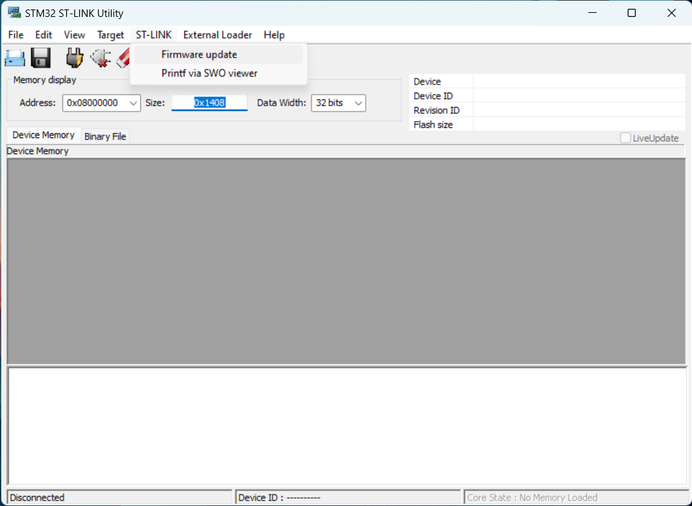
</p>

<p align="center">
  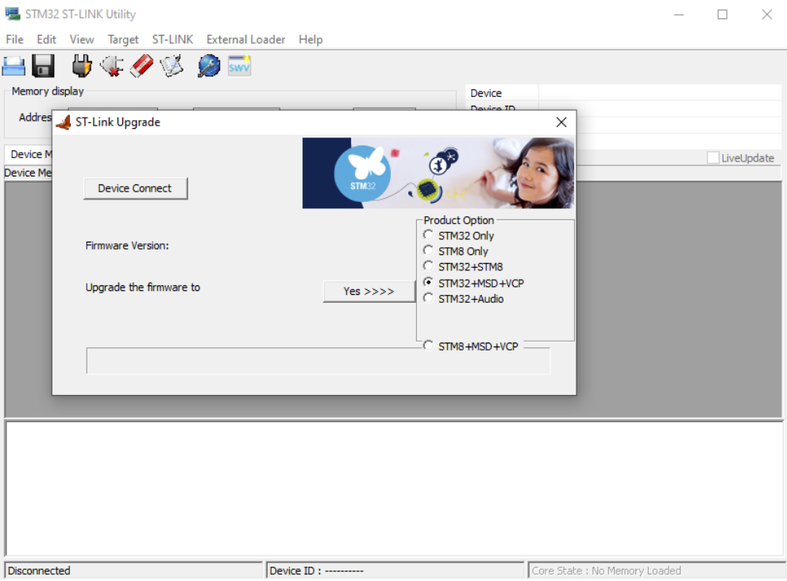
</p>


5- Use CubeProgrammer to upgrade to latest firmware

<p align="center">
  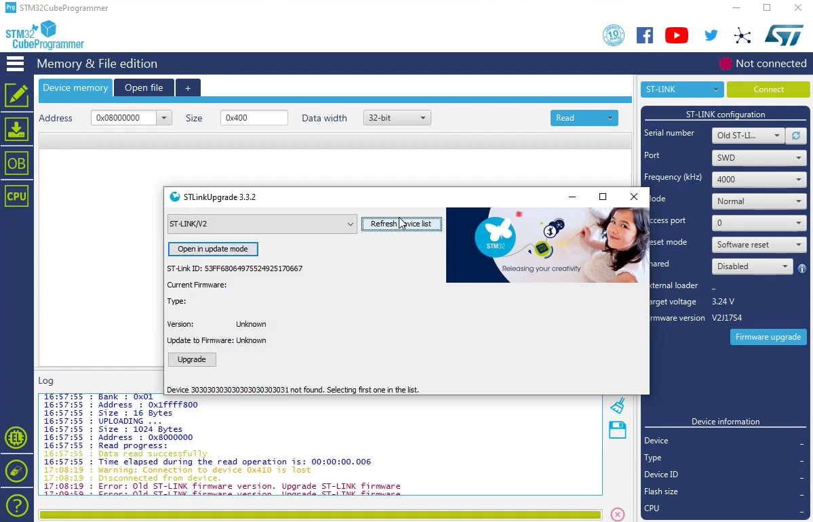
</p>

## Convert ST-Link clone to J-Link

* Note : This procedure may brick your st-link clone and you would need to reflash it, so it advisable to have 2 st-link clones so if you brick one you can reflash with the other.
1. Use STLinkReflash (Version 190812)
    - only use this version (included in the repo)
2. Modify the following offsets in STLinkReflash.exe or use the included prepatched version
  2566 3C > 38
  2567 40 > C0
  26B2 3C > 38
  26B3 4A > C0
3. Run STLinkReflash.exe and accept, selecting option 1.

<p align="center">
  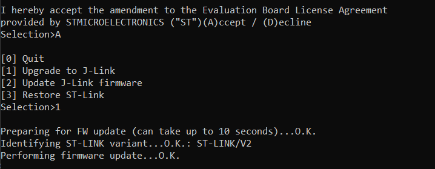
</p>


<p align="center">
  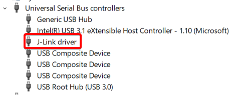
</p>

* SEGGER system view can be used with it 

<p align="center">
  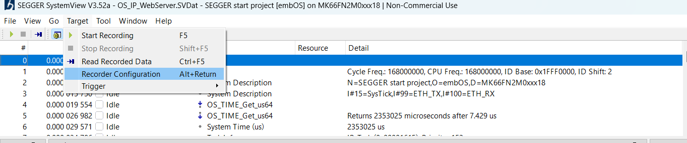
</p>

<p align="center">
  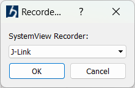
</p>

<p align="center">
  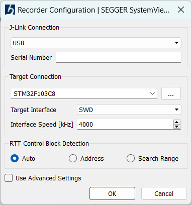
</p>

<p align="center">
  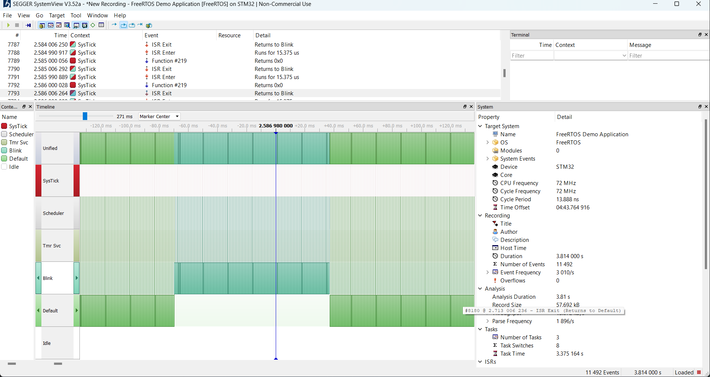
</p>
